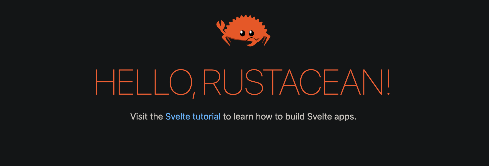

# rsvelte

> *A starter for Svelte using Javascript, Rust and Wasm following the Atomic Design methodology*



[About](#about) - [Architecture](#architecture) - [Code Style](#codeStyle) - [Format](#format) - [Unit Testing](#unitTesting) - [Development](#development) - [Supports](#supports)

## <a id="about"></a> About

If you like **Atomic Design** and **Component-driven Development** but above all **Svelte**. this starter kit might appeal to you.

I often use this configuration for my creative projects so why not share it with those who are interested. That's what open source is for: *sharing.*

This starter is not production ready but you can still use it for side projects. for those who want a `ts` version, look at the repo [rsvelte](https://github.com/monsieurbadia/rsvelte).

## <a id="architecture"></a> Architecture

`/back`

The `back` folder is not implemented yet. Feel free to implements your own. For the next step, I will use `rust nightly` as a back-end. It will works perfectly with the `wasm` folder. For example, if you need to ports some back-end functions to web assembly, it's better to continue using `rust`.

`/front`

The `front` folder uses `svelte` as a front-end framework and `storybook` for the component-driven development. The component approach thus follows the Design Atomic methodology (atoms, molecules, organisms, etc) and the `sass` architecture follows the `pattern 7-1` of [sass-guidelines](https://sass-guidelin.es).

`/wasm`

The `wasm` folder contains all the *Web Assembly* part using `rust nightly`. everything about `wasm` should be implemented in this folder.

## <a id="codeStyle"></a> Code Style

This starter kit uses `estlint` and `stylelint` to ensure that your code is clean, readable and follows the best style conventions.

## <a id="format"></a> Format

You can format your codebase by running the `prettier` command.   

see the commands section [below](#commands).

## <a id="unitTesting"></a> Unit Testing

It supports `jest` as a testing framework for `javascript`

## <a id="development"></a> Development

[Rust](https://www.rust-lang.org/tools/install) and [Cargo](https://doc.rust-lang.org/cargo/getting-started/installation.html) must be installed on your machine before.

**clone**

```sh
git clone https://github.com/monsieurbadia/rsvelte-ts.git
```

**install**

```sh
cd front
yarn install
```

<a id="commands"></a> **commands**

| cmd             | desc                              |
|-----------------|-----------------------------------|
| build           | build the project                 |
| dev             | run the dev environment           |
| fmt             | format your entire codebase       |
| lint:code       | check your entire codebase        |
| lint:style      | check your entire style sheets    |
| start           | serve the public environment      |
| storybook       | run the storybook dev environment |
| storybook:build | build the storybook project       |
| test:unit       | run the unit tests                |
| test:clear      | clean the jest cache              |

## <a id="supports"></a> Supports

* [x] eslint
* [x] jest
* [x] prettier
* [x] rollup
* [x] rust
* [x] storybook
* [x] svelte
* [x] stylint
* [x] javascript
* [x] wasm
 
## <a id="license"></a> License

[MIT](./LICENSE)
